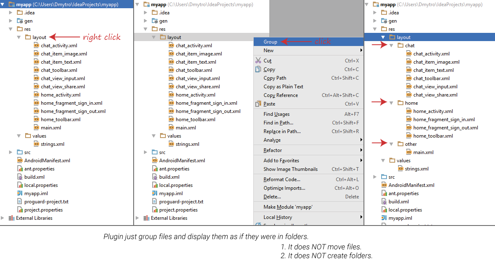
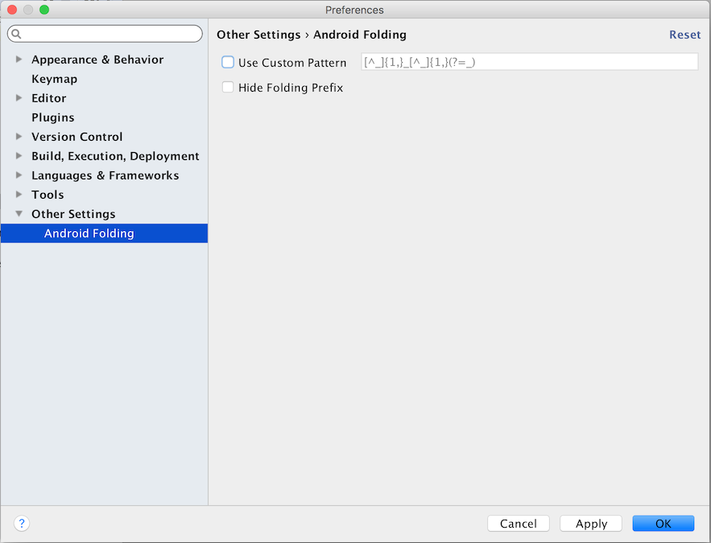
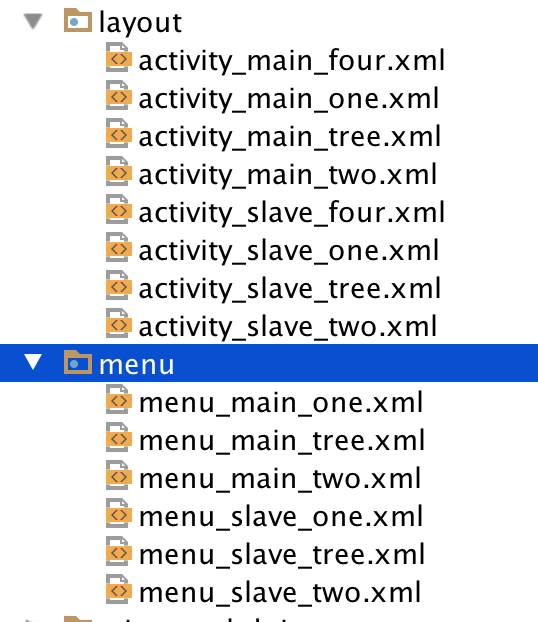
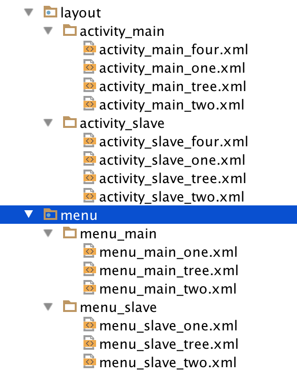
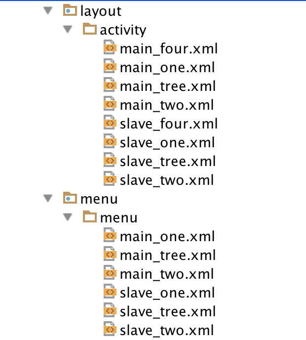
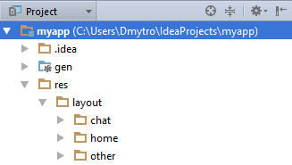

## Android File Grouping Plugin v1.1



## Description

This plugin is very helpful in Android Development. It can display your files as a group of different folders in project structure view.

**Note:**

- It does NOT move files.
- It does NOT create folders.

Naming rules: folder name -> file name part till underscore

Before grouping

```
res/
    layout/
      chat_activity.xml
      chat_toolbar.xml
      chat_item.xml
      chat_share_view.xml
      home_activity.xml
      home_toolbar.xml
      home_fragment_sign_in.xml
      home_fragment_sign_up.xml
```

After grouping

```
res/
    layout/
      chat/
        chat_activity.xml
        chat_toolbar.xml
        chat_item.xml
        chat_share_view.xml
      home/
        home_activity.xml
        home_toolbar.xml
        home_fragment_sign_in.xml
        home_fragment_sign_up.xml
```

## Installation & Usage

Installation

1. Download latest Android File Grouping zip file [here](https://github.com/dmytrodanylyk/folding-plugin/releases)
2. Open AS `Settings`, and select `Plugins`
3. Click `Install from disk` and choose `Android File Grouping.zip`
4. Restart

Usage

1. Rick click on layout folder (or any other)
2. In context menu click Group/Ungroup

Settings

Plugin setting can be found by path 'Settings'('Preferences' on Mac Os) -> 'Other Settings' -> 'Folding Plugin'  



By default, grouping happens by part of filename which situated before first symbol underscore(_). Also, this part 
of filename is not hide. Patter for grouping setup as regular expression and can be change 'Setting' -> 'Other Setting' 
-> 'Android Folding' -> 'Use custom pattern'. 'Hide Folding Prefix' take potability hide part of filename with 
complete with pattern.

| Default       | Folding default  | Folding with hide prefix |
| ------------- |:----------------:| :-----------------------:|
|  |  |  |

## Limitations

The Android project view defines its own structure and does not allow modifying the structure through any extensions. Make sure your are in Project structure view, NOT Android.



## Credits & License

Special thanks to [beta testers](screenshots/Beta_Testers.PNG).

```
The MIT License (MIT)

Copyright (c) 2015 Danylyk Dmytro

Permission is hereby granted, free of charge, to any person obtaining a copy
of this software and associated documentation files (the "Software"), to deal
in the Software without restriction, including without limitation the rights
to use, copy, modify, merge, publish, distribute, sublicense, and/or sell
copies of the Software, and to permit persons to whom the Software is
furnished to do so, subject to the following conditions:

The above copyright notice and this permission notice shall be included in all
copies or substantial portions of the Software.

THE SOFTWARE IS PROVIDED "AS IS", WITHOUT WARRANTY OF ANY KIND, EXPRESS OR
IMPLIED, INCLUDING BUT NOT LIMITED TO THE WARRANTIES OF MERCHANTABILITY,
FITNESS FOR A PARTICULAR PURPOSE AND NONINFRINGEMENT. IN NO EVENT SHALL THE
AUTHORS OR COPYRIGHT HOLDERS BE LIABLE FOR ANY CLAIM, DAMAGES OR OTHER
LIABILITY, WHETHER IN AN ACTION OF CONTRACT, TORT OR OTHERWISE, ARISING FROM,
OUT OF OR IN CONNECTION WITH THE SOFTWARE OR THE USE OR OTHER DEALINGS IN THE
SOFTWARE.
```
